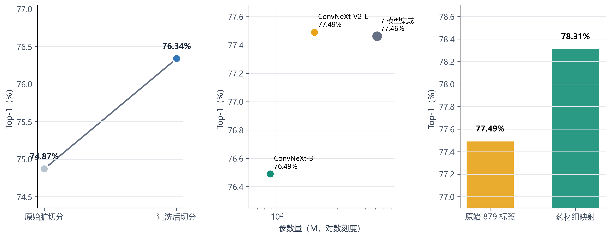
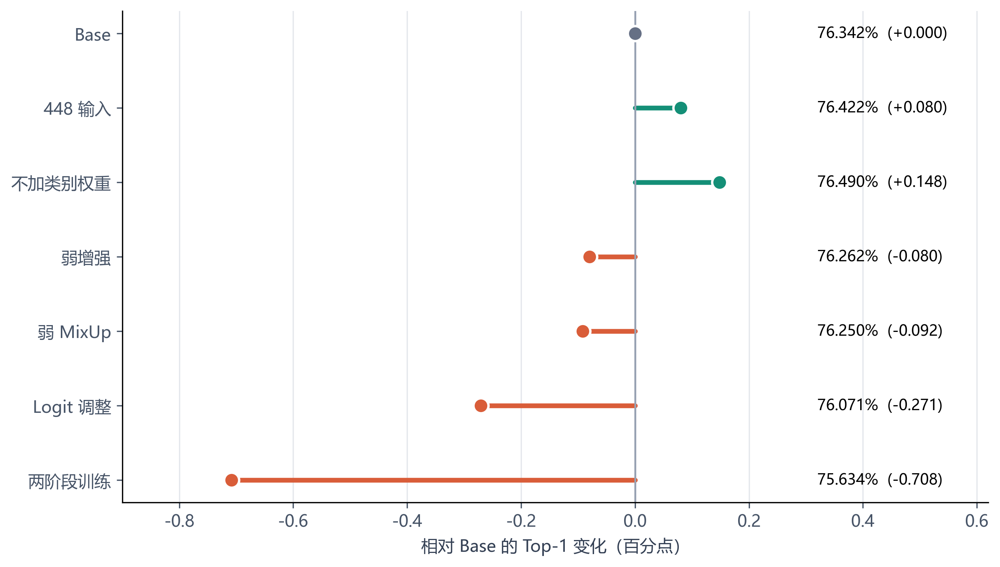
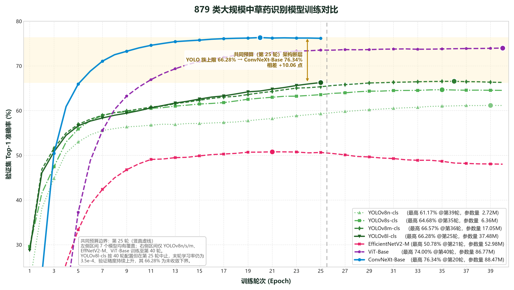
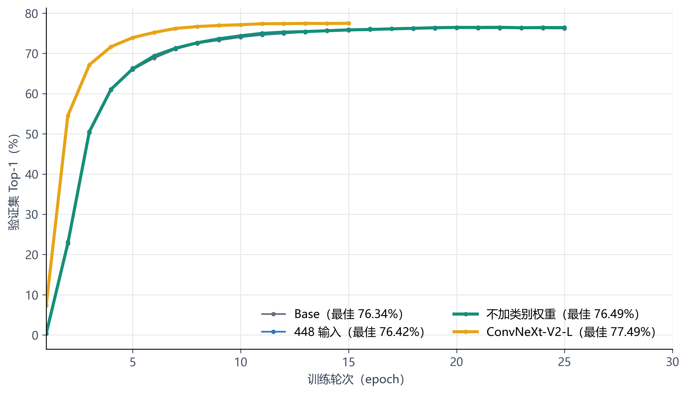

# chinese-herb-879-training

**English · [中文](README.md)**

**879-class fine-grained Chinese herb image recognition: where is the accuracy ceiling, and what is holding it back?**

> A complete record of a training research project: data cleaning → recipe ablation → ensembling → capacity check → label merging.
> 167k images, 879 herb classes, trained on cloud GPUs (AutoDL RTX 3090/4090). Under a strict clean-evaluation protocol, the best accuracy goes from 74.87% all the way to **78.31%**.

---

## 1 · What problem is this?

Herb recognition looks like standard image classification — "give me a picture, tell me the herb." But compared with cats vs. dogs, it has three natural difficulties:

- **Many classes, and they look alike**: 879 categories, many of which are visually near-identical (Chinese yam vs. Dioscorea, Gastrodia vs. cactus slices) — the human eye alone cannot tell them apart;
- **Same herb, many names (synonyms)**: the dataset splits one herb into multiple classes — Salvia miltiorrhiza is also Gansu salvia, Dendrobium has Tiepi and Jinchai variants. The model has to learn "one herb" as "two classes," which is pure extra burden;
- **Different herbs that look alike**: Xuan-shen and Ku-xuanshen are actually two distinct herbs — no confusion allowed.

Worse, **the raw data itself is dirty**: labels in the dataset conflict (the same image is tagged with different class names). If you train on that directly, the model can "cheat" — it may memorize a specific image instead of learning to recognize herbs, and the experimental conclusions become untrustworthy.

So underneath the headline "train a 879-class classifier," this project answers two deeper questions:

> **① Once the data and the training methods are fully regularized, how far can model accuracy actually go?**
> **② What really caps the accuracy — the data, the training recipe, or the model architecture itself?**

## 2 · Background

This repository is the **research extension** of our course project, *A Chinese Herb Detection System Based on Deep Learning*. The main system targets 47 common herbs and ships as a usable desktop app (recognition, mock exams, wrong-answer book, etc.). Here (the 879-class research mode) our job is to push accuracy to its *research limit*:

Using an open-source competition dataset ([Kaggle chinese-medicine-image](https://www.kaggle.com/competitions/chinese-medicine-image), 167k images / 879 classes), we systematically explored four-to-five experiment tracks — all under a **clean-evaluation protocol**: leakage-free split, no test-set contamination, and no manual tuning on the validation set.

## 3 · Key results at a glance



This figure is the whole study in miniature: every regularization or improvement step moves accuracy one notch up, until it reaches 78.31% under the "merged-by-herb-group" evaluation.

| Stage | Metric | Value | What this row means |
|:---|:---|:---|:---|
| Data cleaning | Dirty split → clean baseline | 74.87% → **76.34%** (+1.47) | Without touching a single model, just fixing leakage/label conflicts, accuracy rose 1.47 points |
| Recipe ablation | Spread across 7 recipes | only **0.85pt** | No matter how you tune the recipe, you get at most 0.85 — the bottleneck is not the recipe |
| Ensembling | Logits average of 7 models | **77.46%** (+0.97 over best single) | Letting 7 models with different blind spots vote beats the best single model by 0.97 |
| Capacity check | ConvNeXt-V2-L single model (197M, 15 epochs) | **77.49%** | One much bigger model alone beats the 7-model ensemble |
| Label-merging eval | Merge synonyms by "herb group" | **78.31%** | The labels themselves cap accuracy; aligning labels to herb semantics recovers 0.83 |
| Kaggle public LB ref | V2-L clean-split validation | **0.77490** | On par with the top segment of the public leaderboard (2025-05) |

> Full raw evidence lives in [`results/`](results/): per-epoch `train_results.json` for 8 runs, `ensemble_result.json`, `merge_eval_result.json`.

---

## 4 · The five research steps

One sentence: **data cleaning → recipe ablation → ensembling → capacity check → label-merging eval**. Each step starts with a clear question; then we act.

### Step 1 · Clean the data so it tells the truth (Phase A)

**Question**: Do the "cheating" items in the data invalidate the conclusions?

**What we did**: Full MD5 scan of 167k images. If the same image was tagged with different class names, we isolated it; if the same image appeared in both train and valid, we removed it. Then we rebuilt a leakage-free 90/10 split by "image group" (all copies of one image move together).

**Result**: 5,236 conflict images isolated (2,522 groups); 1,017 cross-split leakage images removed; final split = **145,537 train / 16,244 valid / 879 classes**.

**What it means**: On the clean split, the same ConvNeXt-B baseline jumped from 74.87% to **76.34%** (+1.47). This is "found money" — we never changed the model. **Data quality is the first barrier.**

### Step 2 · Recipe ablation: how much do training details matter? (Phase C)

**Question**: If we tune the default training recipe to its optimum, how much accuracy do we squeeze out?

**What we did**: Fixed one model (ConvNeXt-B) and one protocol (25 epochs, batch32×grad_accum2, warmup5, EMA, cosine decay). Changed **one** variable per run across 7 recipes: no-weighted sampling / 448 resolution / weaker augmentation / mixup 0.1 / Logit Adjustment / two-stage fine-tuning.

**Result**: Best recipe = **no-weighted sampling at 76.49%**; worst 75.64%. Spread across the 7 recipes: only **0.85pt**.

**What it means**: Once the data is clean and the default recipe is well-tuned, recipe tweaks buy you at most 0.85 point — **the bottleneck is not the training recipe.** Hitting a wall here tells you where the real ceiling lives.



### Step 3 · Ensembling: let the models correct each other (Phase D)

**Question**: Do models trained with different recipes make complementary errors?

**What we did**: Averaged the logits of the 7 ablation checkpoints — a 7-model vote.

**Result**: **77.46%**, which is +0.97 over the best single model (76.49%).

**What it means**: Different recipes do give the models different blind spots, and ensembling stitches them together. It also hints that **single-model accuracy is the real ceiling**; ensembling only builds on a limited foundation.

### Step 4 · Capacity check: is the model just not big enough?

**Question**: Does pushing model scale break through the accuracy ceiling?

**What we did**: Fine-tuned an ImageNet-22K-pretrained ConvNeXt-V2-L (197M params) for 15 epochs; as a control, we ran a DINOv2 frozen-feature linear probe.

**Result**: V2-L single model **77.49%** — one model already beats the 7-model ensemble (77.46%). Meanwhile the DINOv2 frozen-feature probe reaches only **71.24%**.

**What it means**: ① Capacity works — a bigger model breaks past the ensemble limit; ② "freeze generic features + train a head" is not enough here. **879-class fine-grained recognition depends heavily on domain fine-tuning.**

### Step 5 · Label merging: how much do synonyms cost?

**Question**: How much accuracy does the "one herb split into several classes" issue itself suppress?

**What we did**: Merged the mergeable synonyms/geo-variants (Salvia ↔ Gansu salvia, Dendrobium ↔ Tiepi dendrobium, etc. — **15 groups, 30 classes**) into herb groups and re-evaluated; meanwhile we kept the un-mergeable look-alike pairs (Xuan-shen ↔ Ku-xuanshen) distinct.

**Result**: After merging, accuracy rises to **78.31%**; the involved 30 classes jump from **58.35% to 84.68%**.

**What it means**: The dataset's labeling convention is itself an invisible "accuracy ceiling." Aligning labels to herb semantics recovers a visible gain — which also retroactively explains why Step 1's cleaning was worth doing.

### Training process at a glance

The next two figures record the full convergence process for all models — direct evidence for the conclusions above:





> **How to read the plots**: there is a vertical dashed line at epoch 25. Every cross-model conclusion uses the common-budget view (≤25 epochs), so a 40-epoch model does not get to "bully" a 25-epoch one.
> **One detail worth mulling**: scaling the YOLO family 13.8× in parameters (2.72M→37.48M) buys only +5.40 accuracy at the 40-epoch view, with diminishing n→s→m gains — while ConvNeXt-B leads the *entire* YOLO family by **+10.06 points** under the same budget. Fine-grained recognition feeds on the backbone's **representation capacity and pretraining distribution**; no amount of classification-head size makes up for it.

---

## 5 · Model weights (ModelScope)

Every checkpoint exceeds GitHub's 100MB per-file limit, so **weights are not stored in this repo**. They are published on ModelScope:

**Page: https://www.modelscope.cn/models/Lihuahua2022/chinese-herb-879-training**

879-class weights:

| File | Size | Description |
|:---|:---|:---|
| `ConvNeXt-B_879类_no_weighted_best.pth` | 354 MB | **Best ablation recipe** (no-weighted sampling, 76.49%) |
| `ConvNeXt-V2-L_879类_best.pth` | 791 MB | **Capacity check** (197M, single model 77.49%) |
| `training_artifacts/ConvNeXt-B_879类_脏切分.pth` | 354 MB | Dirty-split baseline (74.87%) |
| `training_artifacts/ViT-Base_879类_patch16_384.pth` | 347 MB | Comparison model (74.00%) |
| `training_artifacts/EfficientNetV2-M_879类.pth` | 214 MB | Comparison model (50.78%) |
| `training_artifacts/YOLOv8l-cls_879类_best.pt` | 299 MB | Largest YOLO scale (unconverged lower bound 66.28%) |
| `training_artifacts/YOLOv8m-cls_879类_best.pt` | 34 MB | 66.57% |
| `training_artifacts/YOLOv8s-cls_879类_best.pt` | 12.5 MB | 64.68% |
| `training_artifacts/YOLOv8n-cls_879类_best.pt` | 5.2 MB | 61.17% |

Datasets:

- 879-class: [Kaggle competition dataset](https://www.kaggle.com/competitions/chinese-medicine-image) (167k images / 879 classes) · [ModelScope mirror](https://www.modelscope.cn/datasets/Lihuahua2022/Chinese_medicine_image)
- 47-class (herbal-eoeld V5): [ModelScope dataset](https://www.modelscope.cn/datasets/Lihuahua2022/zhongcaoyao)

---

## 6 · Training code & quick start

### Code layout

`kaggle/` holds all training & evaluation scripts, runnable on AutoDL or a local GPU. Each script is annotated with what it does:

```
kaggle/
├── train_convnext.py          # ConvNeXt-B training (879-class baseline; also used for V2-L capacity check)
├── train_vit.py               # ViT-Base training
├── train_efficientnet.py      # EfficientNetV2-M training
├── train_yolov8{n,s,m,l}.py   # YOLOv8-cls four scales (Ultralytics)
├── train_ablation.py          # Step-2 main script: 7 ablation recipes
├── clean_dataset.py           # Step-1 data cleaning (MD5 conflict isolation / leak-free split)
├── check_duplicates.py        # same-image-different-label conflict detection
├── split_dataset.py           # split utilities
├── download_kaggle.py         # kagglehub dataset download
├── diagnose_results.py        # per-class diagnostics (per-class / confusion pairs / buckets)
├── analysis_plots.py          # reject Risk-Coverage / ECE calibration / t-SNE
├── dinov2_probe.py            # Step-4 DINOv2 frozen-feature linear probing baseline
├── ensemble_eval.py           # Step-3 7-model logits ensemble evaluation
├── merge_eval.py              # Step-5 synonym "herb group" merged evaluation
├── summarize_ablations.py     # ablation summary
├── alias_analysis.py          # synonym/geo-variant label analysis (with aliases.json)
├── ssh_helper.py              # AutoDL training process management helper
├── notify_email.py            # training-complete email notification
├── run_all_ablations.sh       # run all 7 ablations in background (nohup)
├── run_v2l.sh / watch_v2l.sh  # V2-L training & monitoring
├── watch_and_shutdown.sh / status.sh  # progress monitoring / auto shutdown of cloud host
└── README_autodl.md           # AutoDL cloud run instructions
```

### Quick start

```bash
# 1. Environment
conda create -n herb python=3.10
pip install -r requirements.txt        # install CUDA-matching torch/torchvision first

# 2. Data (~167k images)
python kaggle/download_kaggle.py       # download raw dataset
python kaggle/clean_dataset.py         # clean → dataset_kaggle_clean (9.1GB)

# 3. Training (GPU ≥ 24GB VRAM recommended, e.g. RTX 3090/4090)
python kaggle/train_convnext.py --epochs 25                      # 879-class baseline ConvNeXt-B
bash kaggle/run_all_ablations.sh                                 # 7 ablation recipes
python kaggle/train_convnext.py --model convnextv2_large --epochs 15 --img_size 384   # V2-L

# 4. Evaluation & analysis
python kaggle/diagnose_results.py --dir results_ablation/runs_ablation/no_weighted
python kaggle/ensemble_eval.py
python kaggle/merge_eval.py
python kaggle/analysis_plots.py
```

Cloud batch training (AutoDL) and monitoring scripts: see [`kaggle/README_autodl.md`](kaggle/README_autodl.md).

---

## 7 · Technical details

Everything you need to reproduce or dig into specifics is laid out here.

### 7.1 Model selection (879 classes, 7 models)

| Model | Params | Epochs | Best Top-1 | Best epoch | Common budget (≤25 ep) |
|:---|:---:|:---:|:---:|:---:|:---:|
| YOLOv8n-cls | 2.72M | 40 | 61.17% | 39 | 59.30% |
| YOLOv8s-cls | 6.36M | 40 | 64.68% | 35 | 63.57% |
| YOLOv8m-cls | 17.05M | 40 | 66.57% | 36 | 65.34% |
| YOLOv8l-cls \* | 37.48M | 25 (stopped) | 66.28% | 25 | 66.28% |
| EfficientNetV2-M | 52.98M | 40 | 50.78% | 21 | 50.78% |
| ViT-Base | 86.77M | 40 | 74.00% | 40 | 73.54% |
| **ConvNeXt-Base** | 88.47M | 25 | **76.34%** | 20 | **76.34%** |

\* YOLOv8l-cls was configured for 40 epochs but stopped at epoch 25, with the learning rate still at 3.5e-4 and accuracy still rising; 66.28% is its **unconverged lower bound**.

> **Reading**: at the 40-epoch view, scaling YOLO 13.8× in parameters (2.72M→37.48M) buys only +5.40 with diminishing n→s→m gains; under the same budget ConvNeXt-B leads the entire YOLO family by a wide margin (+10.06). **A stronger backbone beats a bigger classification head.**

### 7.2 Training-recipe ablation (fixed ConvNeXt-B, clean split, 25 epochs)

| Config | Key change | Best Top-1 | Best epoch |
|:---|:---|:---:|:---:|
| `base` | Baseline (weighted sampling + RandAugment m7 + MixUp 1.0, 384px) | 76.34% | 20 |
| `no_weighted` | Drop weighted sampling → instance sampling | **76.49%** ✔ | 22 |
| `base_448` | Input size 448px (batch16×accum4) | 76.42% | 23 |
| `weak_aug` | RandAugment m7→m4, RandomErase 0.2→0.05 | 76.27% | 23 |
| `weak_mixup` | MixUp/CutMix prob 1.0→0.1 | 76.25% | 21 |
| `logit_adjust` | Instance sampling + MixUp off + Logit Adjustment Loss | 76.08% | 17 |
| `two_stage` | Freeze backbone first 10 epochs, head-only then full FT | 75.64% | 25 |

> **Reading**: the best recipe (`no_weighted`, instance sampling) beats the baseline by only 0.15; the spread is 0.85. Interpretation: **once the data is clean and the default recipe is good, recipe details are not the deciding factor.**

### 7.3 Ensembling · capacity · label merging (summary)

| Method | Top-1 | Note |
|:---|:---:|:---|
| 7-model logits ensemble | 77.46% | +0.97 over best single model, complementary errors |
| **ConvNeXt-V2-L (197M, 15 epochs)** | **77.49%** | single model already beats the 7-model ensemble |
| DINOv2 frozen-feature linear probe | 71.24% | frozen features are insufficient for 879 classes |
| Merged eval by "herb group" | **78.31%** | 15 groups / 30 classes, involved classes 58.35% → 84.68% |

Synonym/geo-variant merging (sample; full list in `results/merge_eval_result.json`):

| Herb group | Samples | Raw correct → merged correct |
|:---|:---:|:---:|
| Epimedii folium / wushan variant | 33 | 15 → 30 |
| Salvia miltiorrhiza / Gansu salvia | 32 | 14 → 28 |
| Dipsaci radix / Sichuan dipsacus | 30 | 14 → 26 |
| Luffa sponge / cantonese luffa | 34 | 23 → 32 |
| Paris polyphylla / Chonglou | 39 | 22 → 35 |
| Pueraria / Fen-ge | 39 | 24 → 34 |

### 7.4 Training environment

| Item | Setting |
|:---|:---|
| GPU | AutoDL RTX 3090 / 4090 (24GB); local RTX 5070 for inference validation |
| Framework | PyTorch 2.9 + timm 1.0 + Ultralytics 8.4 |
| Optimizer | AdamW + warmup(5) + cosine decay + EMA |
| Regularization | DropPath 0.2 / weight_decay 0.05 / label smoothing 0.1 / RandAugment |
| Effective batch | 64 (batch32 × grad_accum2; 448px → batch16 × accum4) |

### 7.5 Reproducibility notes

- **Leakage-free split**: MD5 "image-group" isolation — no identical image appears in both train and valid.
- **Comparable protocol**: the 7-model comparison uses the same default recipe for single runs; all cross-model conclusions use the common-budget (≤25 epochs) view.
- **Non-deduplicated eval**: all validation metrics are computed on raw class labels, no label dedup.
- Training curves and per-epoch history: see [`results/runs_ablation/*/train_results.json`](results/runs_ablation).

---

## 8 · Data license

[Kaggle chinese-medicine-image competition dataset](https://www.kaggle.com/competitions/chinese-medicine-image) — usage must follow Kaggle competition terms. The 47-class herbal-eoeld V5 dataset comes from Roboflow public datasets. Weights are published on ModelScope for learning/research purposes only.